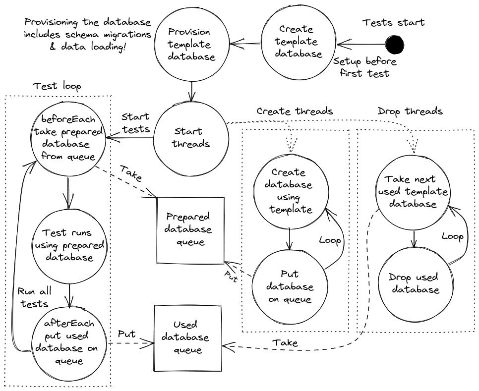

# PgPool

Supercharge your unit tests by provisioning your PostgreSQL database once, then using it as a
template database for each test! Pairs well with [Testcontainers] and [Liquibase].

## How it works

By integrating with the test framework PgPool prepares (or reuses from a previous run) a template database by applying the database initialization process, such as running [Liquibase migrations].
This initialization process also produces a checksum which is used to automatically determine if a
template database from a previous run is compatible.

PgPool will start creating test databases using a configurable amount of threads,
so it can create databases while the tests are running. The databases are created using PostgreSQL
[template databases] which allow for significantly faster creation than running a migration tool
repeatedly.

Before each test a clean database is taken and made available to the test, and afterwards it is
marked for deletion. A configurable amount of threads are started to drop the used databases while
the tests are running. Once the JVM shuts down, PgPool will optionally wait and try to drop all
created databases.



## How to use

Available on [jitpack.io](https://jitpack.io/#wouterh-dev/java-postgresql-test-pool):

```xml
<dependencies>
  <dependency>
    <groupId>com.github.wouterh-dev.java-postgresql-test-pool</groupId>
    <artifactId>pgpool-junit5</artifactId>
    <version>master-SNAPSHOT</version> <!-- Change to release tag! -->
    <scope>test</scope>
  </dependency>
  <dependency>
    <groupId>com.github.wouterh-dev.java-postgresql-test-pool</groupId>
    <artifactId>pgpool-hikari</artifactId>
    <version>master-SNAPSHOT</version> <!-- Change to release tag! -->
    <scope>test</scope>
  </dependency>
  <dependency>
    <groupId>com.github.wouterh-dev.java-postgresql-test-pool</groupId>
    <artifactId>pgpool-testcontainers</artifactId>
    <version>master-SNAPSHOT</version> <!-- Change to release tag! -->
    <scope>test</scope>
  </dependency>
</dependencies>

<repositories>
  <repository>
    <id>jitpack.io</id>
    <url>https://jitpack.io</url>
  </repository>
</repositories>
```

Instantiate a [PgPoolManager] and call `beforeEach` before each test, and `afterEach` after
each test.
Then during the test, use `getPreparedDatabase(name).getConnection()` to get connections. For a full
example including Liquibase migrations, a HikariCP connection pool and Spring Boot integration, see
the example Spring Boot [Test] & [Configuration].

### Getting started

First you need a PostgreSQL database server to use. You can assume one is already running, or you
can start one using, for example, [Testcontainers]:

```java
PostgreSQLContainer postgreSQLContainer = new PostgreSQLContainer<>("postgres:14")
  .withCommand("-N", "2000", "-c", "fsync=off")
  .withReuse(true);
```

Then a [PgPoolConfig] instance must be created:

```java
PgPoolConfig config = PgPoolConfig.builder()
  .connectionProvider(new PostgreSQLContainerConnectionProvider(postgreSQLContainer))
  .waitForDropOnShutdown(TestcontainersConfiguration.getInstance().environmentSupportsReuse())
  .pooledDatabase(PooledDatabase.builder()
      .name("db1")
      .createThreads(2)
      .spares(5)
      .initializer(new LiquibaseDatabaseInitializer("db/changelog/changelog.xml"))
      .build())
  .build();
```

Each database requires one or more [DatabaseInitializer]s. These will be used to apply migrations or
fill the template database once during initialization. If the PostgreSQL database server is reused
between test executions it is important that these [DatabaseInitializer]s correctly implement the
`calculateChecksum` method so that PgPool can detect whether a template from a previous run is
compatible and may be reused.

Then a [PgPoolManager] may be instantiated, either directly or via one of the test framework integrations.

### JUnit 5

See the [JUnit5] example

### JUnit 4

See the [JUnit4] example

### Spring Boot

See the Spring Boot [Configuration] & [Test] example. These examples include the configuration of a
HikariCP DataSource, Liquibase migrations and how to use Spring-managed beans to initialize a
template database.

[JUnit4]: pgpool-junit4-example/src/test/java/nl/wouterh/pgpool/junit4/example/SampleJUnit4Test.java

[JUnit5]: pgpool-junit5-example/src/test/java/nl/wouterh/pgpool/junit5/example/SampleJUnit5Test.java

[Test]: pgpool-spring-boot-example/src/test/java/nl/wouterh/pgpool/spring/example/SampleSpringTest.java

[Configuration]: pgpool-spring-boot-example/src/test/java/nl/wouterh/pgpool/spring/example/PgPoolConfiguration.java

[Liquibase migrations]: pgpool-liquibase/src/main/java/nl/wouterh/pgpool/liquibase/LiquibaseDatabaseInitializer.java

[Template databases]: https://www.postgresql.org/docs/current/manage-ag-templatedbs.html

[Testcontainers]: https://www.testcontainers.org/

[Liquibase]: https://www.liquibase.org/

[PgPoolManager]: pgpool-core/src/main/java/nl/wouterh/pgpool/PgPoolManager.java

[PgPoolConfig]: pgpool-core/src/main/java/nl/wouterh/pgpool/PgPoolConfig.java

[PooledDatabase]: pgpool-core/src/main/java/nl/wouterh/pgpool/PooledDatabase.java 

[DatabaseInitializer]: pgpool-core/src/main/java/nl/wouterh/pgpool/DatabaseInitializer.java

[LiquibaseDatabaseInitializer]: pgpool-liquibase/src/main/java/nl/wouterh/pgpool/liquibase/LiquibaseDatabaseInitializer.java
